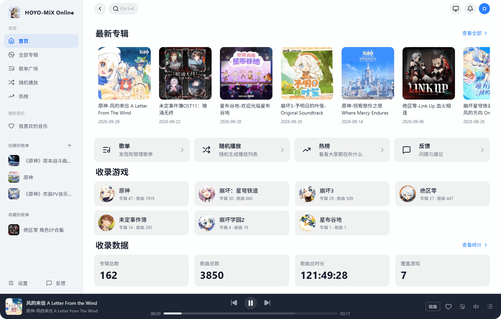
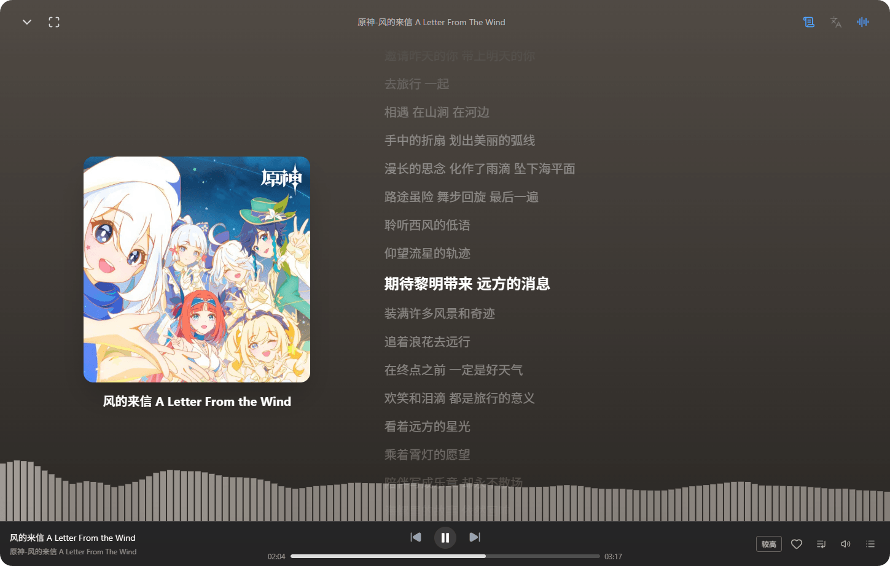

  <h1>HOYO-MiX Online</h1>
  

    <a href="https://hoyomix.amarea.cn">
      在线体验
    </a>
  

  

---

使用 Vue 3 构建的米哈游游戏原声带数据网站

本仓库为项目的前端仓库

## 功能

- **音乐发现**：按游戏、专辑系列和艺术家检索歌曲，支持搜索、热榜与生成随机播放列表。
- **在线播放**：播放队列、循环与随机模式。
- **沉浸式播放器**：全屏播放器、滚动歌词、歌词翻译与音频频谱可视化。
- **歌单与收藏**：创建、编辑、分享歌单，收藏歌曲和歌单。
- **互动交流**：账号登录、发表评论。
- **便捷体验**：主题与背景设置、桌面及移动端适配、快捷键操作。

## 声明

> [!WARNING]
> 本网站由爱好者制作，并非 HOYO-MiX 官方网站。 网站内使用的图标、专辑图片、文本，仅用于信息展示，其版权属于 米哈游/miHoYo/上海米哈游网络科技股份有限公司

## License

[MIT License](LICENSE)
